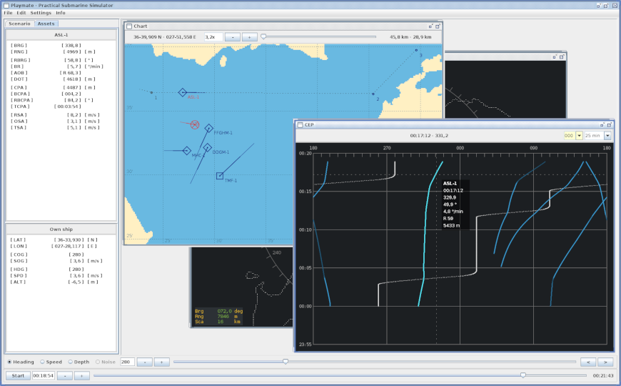

# Playmate

A Practical Submarine Simulator that is written in Java ...

	

## What is Playmate?

Playmate is a submarine simulator designed for training in target motion analysis (TMA) exclusively using the contact evaluation plot (CEP). The CEP is a time-bearing diagram on a submarine showing the trace of sound emissions tracked by sonar. Furthermore, the CEP is a valuable tool for planning own sub's movement in tactical and abrupt situations. Hence, reading the CEP correctly is an important skill for sonar personnel and the officer of the watch when operating submerged. For sharpening the skills of CEP reading extensive training is crucial. And there, Playmate comes into play.

## Why this name?

The APP-7 (Joint Brevity Words Publication) defines "playmate", inter alia, as follows: "a submarine with which I am co-operating". The brevity word "playmate" is mostly used by aircraft for tactical radio communication while initiating an exercise with a submarine. Because of the all-around bird's-eye view in the simulator, in particular at charts, one could imagine being in an aircraft staying on top of the submarine playing with. That's it.

## What is here?

This repository contains the Java codebase of Playmate and a simple Ant script for building it. In total, the codebase got about 130 classes, roughly 15000 lines of code and more than 1000 lines for comments. However, about half of the codebase can be considered as being a library providing more or less common functionality.

A ready-to-go version of Playmate is available on the [release page](https://github.com/m6c7l/playmate/releases), everything else is a story of an Ant.

## How to use it?

Playmate runs on every PC with Java 1.6+ installed. The graphical user interface (GUI) is optimized for usage with a wheeled mouse.

In general, the workflow in Playmate is as follows:

1. Select a chart with your desired geographical area of operation.
2. Drag the own ship to the desired position in the chart.
3. Drag assets to the desired positions in the chart. If necessary, adjust the initial position of any asset.
4. For any asset, change the speed and heading or set waypoints respectively.
5. Select the Assets tab and the CEP window before starting the simulation.
6. Select exercise in the menu to hide anything in the GUI usually not available on a submerged submarine.
7. Try to estimate distance, type of approach, angle on the bow and heading for all assets visible in the CEP.
8. Stop the simulation and compare your estimations with the ground truth at any time using the ruler and time control.

The [quick reference guide](/sources/doc/playmate.pdf) gives an overview of all control options within the GUI.

## Why using it?

Well, it depends. Perhaps you want to ...

- deal with tricky situations, e. g. when the XO orders "prepare periscope depth" in an area with a high level of traffic, knowing you have to be on periscope depth at the latest in 15 minutes to receive the next VLF broadcast.
- be able to give the CO asking for vessels within 4000 yards just after one change, of course, a convincing answer at any time.
- find the optimal course to intercept a suspect far away by using a steady bearing.
- impress the guy next to you responsible for TMA with decent target data acquired with your CEP magic and some mental math.
- be able to build up and maintain a robust surface picture by looking exclusively at the sound traces of vessels and their trackers from sonar respectively.
- increase your awareness of the importance for own sub's maneuvers supporting most kinds of TMA.
- avoid the need to occupy an expensive shore-side submarine simulator for basic CEP training.
- reconstruct and replay a situation picture you are curious about while having the opportunity to observe figures like resultant speed across (RSA), distance off track (DOT), closest point of approach (CPA), distance and so on for each asset.

## What is not here?

Neither the fundamentals of submarine operations and tactics nor characteristics and technical details about submarines and ships are obtainable by using Playmate or by investigating the codebase.

## Anything else?

1. Initially, I created a console-only predecessor of Playmate for my training a few years ago. Since then the project grew and became a reasonable simulation and reconstruction tool.
2. The codebase could be a good starting point for more advanced simulators or even games.
3. The Java package names in the codebase are (probably) self-explanatory. For the implementation, I picked just a few design patterns, mostly model-view-controller (MVC) and observer.
4. The tactical view in Playmate is not yet finished.
5. To add charts and assets edit the corresponding XML file in the data folder. Just use an existing entry in that file as a template.
6. Due to the project size and time constraints Playmate will not be developed any further.
7. And last but not least, Dolphin 37 & 38.

## Further reading

* MARCOM Northwood UK -- [NATO’s advanced Anti-Submarine Warfare Exercise Dynamic Manta 2017 concludes](https://mc.nato.int/media-centre/news/2017/natos-advanced-antisubmarine-warfare-exercise-dynamic-manta-concludes.aspx)
* United States Navy -- [Operations Specialist, Vol. 01, Ch. 10 (Plotting)](https://www.globalsecurity.org/military/library/policy/navy/nrtc/14308_ch10.pdf)
* Rodrigo da Silva Vieira -- [Towards a game-based periscope simulator for submarine officers tactical training](https://calhoun.nps.edu/handle/10945/49409)
